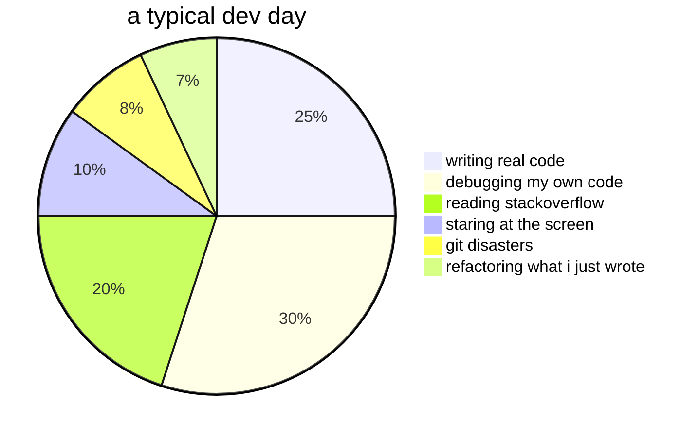
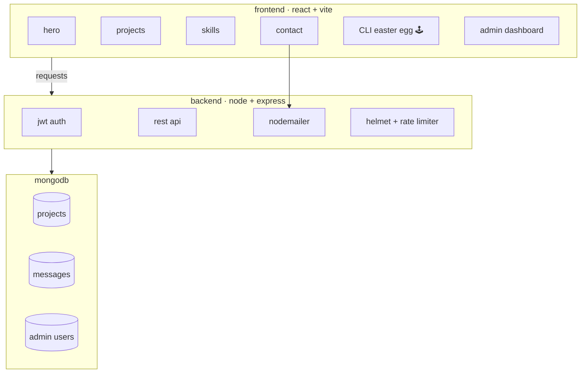
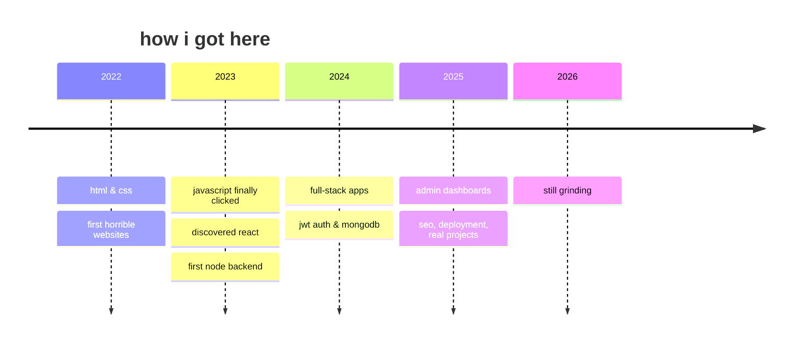

# sup, i'm abdulrahman

> "sometimes it works. sometimes it catches fire. either way, ship it."

i'm a self-taught developer from egypt. i build things, break them, fix them badly, and call it shipping.

- writes code that mostly breaks
- survives on caffeine and regret
- pro at copy-pasting stackoverflow
- makes bugs and then loves them
- `git push --force` is a lifestyle

---

## what i actually know

```
JavaScript   ████████████████████░░░  85%
React        ███████████████████░░░░  80%
Node.js      ████████████████░░░░░░░  70%
CSS / UI     ████████████████████░░░  85%
MongoDB      ███████████████░░░░░░░░  65%
Python       ████████████░░░░░░░░░░░  50%
C++          █████████░░░░░░░░░░░░░░  40%
Git          █████████████████████░░  90%  ← mostly git stash & cry
```

---

## how i actually spend my time



---

## the portfolio project

full-stack portfolio app i built and over-engineered for no reason.



| thing | what it does |
|---|---|
| frontend | react + vite, dark terminal theme |
| backend | express api, jwt, rate limiting |
| db | mongodb |
| security | helmet, bcrypt, input validation |
| easter egg | hidden CLI terminal with commands |
| admin panel | manage projects and messages |
| contact | emails me via nodemailer |
| deployed | vercel |

---

## the journey



---

## github stats

<p align="center">
  
  
  
</p>

<p align="center">
  
  
</p>

---

## find me

- facebook: [abdulrahman](https://www.facebook.com/profile.php?id=100022343641360)
- linkedin: [abdo-khairy](https://www.linkedin.com/in/abdo-khairy-391801305/)
- github: somewhere crying over a merge conflict

---

[](https://visitcount.itsvg.in)


