# sup, i'm abdulrahman 👋

> *"sometimes it works. sometimes it catches fire. i push to main anyway and go touch grass."*

i'm a self-taught developer from egypt 🇪🇬 who learned to code because i was bored and now i can't stop. send help. please. i am not okay.

-  writes code that works once and never again
-  caffeine is not a coping mechanism. it is a personality.
-  stackoverflow is just my unpaid senior developer
-  i don't fix bugs. i negotiate with them. sometimes we reach a deal.
-  `git push --force` and then immediately close the laptop and go to bed
-  has googled "how to center a div" more times than i will ever admit to anyone

---

## what i actually know (according to me, which is a biased source)

```
JavaScript   ████████████████████░░░  85%  ← writes it. fears it. loves it. hates it.
React        ███████████████████░░░░  80%  ← useEffect has broken me as a person
Node.js      ████████████████░░░░░░░  70%  ← it's just javascript but angrier
CSS / UI     ████████████████████░░░  85%  ← i am good at css and i will die on this hill
MongoDB      ███████████████░░░░░░░░  65%  ← NoSQL because structure is for cowards
Python       ████████████░░░░░░░░░░░  50%  ← i know enough to be dangerous and not enough to be useful
C++          █████████░░░░░░░░░░░░░░  40%  ← studied it. traumatized by it. we don't talk about it.
Git          █████████████████████░░  90%  ← the 90% is git stash. the other 10% is crying.
```

---

## how i actually spend my time (an honest investigation)


---

## the portfolio — over-engineered, unhinged, and i regret nothing

i built a full-stack portfolio. for myself. with jwt auth. and an admin dashboard. and a hidden CLI easter egg. nobody asked for any of this. i did it anyway.

```mermaid
graph TB
    subgraph frontend ["frontend · react + vite · yes i used vite, fight me"]
        hero[hero · the part where i lie about myself]
        projects[projects · evidence of my crimes]
        skills[skills · bar charts that i made look higher than they should be]
        contact[contact · please talk to me]
        cli["CLI easter egg 🕹️ · built for 3 people including myself"]
        admin[admin dashboard · so i can feel powerful]
    end

    subgraph backend ["backend · node + express · it's giving 'works on my machine'"]
        auth[jwt auth · because i'm paranoid]
        api[rest api · resting in peace]
        mail[nodemailer · emails me at 3am when someone says hi]
        security["helmet + rate limiter · someone tried to hack me and now i take this personally"]
    end

    subgraph db ["mongodb · my beloved chaotic database"]
        p[(projects · my children)]
        m[(messages · mostly spam)]
        u[(admin users · just me. it's just me.)]
    end

    frontend -->|desperate requests| backend
    backend --> db
    contact --> mail
```



| thing | what it does | was it necessary |
|---|---|---|
| frontend | react + vite, dark terminal theme | yes obviously |
| backend | express api, jwt, rate limiting | probably not but here we are |
| db | mongodb | schemas are a social construct |
| security | helmet, bcrypt, input validation | someone tried something funny once |
| easter egg | hidden CLI terminal | built for me. found by nobody. |
| admin panel | manage projects and messages | i felt like a ceo for 10 minutes |
| contact | emails me via nodemailer | i check it obsessively |
| deployed | vercel | and i refreshed the url 47 times after |

---

## the journey (a tragedy in 5 acts)


---

## currently building 

-  **winsh app** — tow truck platform (react + express + mongodb) because apparently i am the patron saint of egyptian car emergencies
-  finding increasingly unhinged ways to over-engineer things that could be a single html file

---

## my github stats (evidence)


*(the streak is held together by anxiety and spite)*

---

## find me (i am always online. this is not healthy.)

-  facebook: [abdulrahman](https://www.facebook.com/profile.php?id=100022343641360)
-  linkedin: [abdo-khairy](https://www.linkedin.com/in/abdo-khairy-391801305/) ← professional version of me. he is lying.
-  github: [3bdoKH](https://github.com/3bdoKH) ← commit messages get worse after midnight

---

## contact me if...

- ✅ you need a full-stack app built by someone who will over-engineer it for free
- ✅ you want to talk about react, node, or why css is simultaneously my passion and my villain origin story
- ✅ you have a towing company that needs a website. i have experience. too much experience.
- ❌ you're going to tell me to use tabs instead of spaces. i will not recover from this.
- ❌ you're a recruiter asking for "5 years experience in a framework that's 2 years old" — i hope your dropdown menus never align properly
- ❌ you want to tell me my code is "not scalable". it works. leave me alone.

---

[](https://visitcount.itsvg.in)


*(if you read this whole thing, you need to go outside. so do i. we should go together.)*
