# sup, i'm abdulrahman

> *"sometimes it works. sometimes it catches fire. either way, ship it."*

i'm a self-taught developer from egypt 🇪🇬. i build things, break them, fix them badly, and call it shipping.

-  writes code that mostly breaks
-  survives on caffeine and regret
-  pro at copy-pasting stackoverflow
-  makes bugs and then loves them
-  `git push --force` is a lifestyle

---

## what i actually know

```
JavaScript   ████████████████████░░░  85%
React        ███████████████████░░░░  80%
Node.js      ████████████████░░░░░░░  70%
CSS / UI     ████████████████████░░░  85%
MongoDB      ███████████████░░░░░░░░  65%
Python       ████████████░░░░░░░░░░░  50%
C++          █████████░░░░░░░░░░░░░░  40%
Git          █████████████████████░░  90%  ← mostly git stash & cry
```

---

## how i actually spend my time


---

## the portfolio project

full-stack portfolio app i built and over-engineered for no reason.

```mermaid
graph TB
    subgraph frontend ["frontend · react + vite"]
        hero[hero]
        projects[projects]
        skills[skills]
        contact[contact]
        cli["CLI easter egg 🕹️"]
        admin[admin dashboard]
    end

    subgraph backend ["backend · node + express"]
        auth[jwt auth]
        api[rest api]
        mail[nodemailer]
        security["helmet + rate limiter"]
    end

    subgraph db ["mongodb"]
        p[(projects)]
        m[(messages)]
        u[(admin users)]
    end

    frontend -->|requests| backend
    backend --> db
    contact --> mail
```



| thing | what it does |
|---|---|
| frontend | react + vite, dark terminal theme |
| backend | express api, jwt, rate limiting |
| db | mongodb |
| security | helmet, bcrypt, input validation |
| easter egg | hidden CLI terminal with commands |
| admin panel | manage projects and messages |
| contact | emails me via nodemailer |
| deployed | vercel |

---

## the journey


---

## currently building 

-  **wench app** — tow truck service platform (react + express + mySQL)
-  finding new ways to over-engineer simple things

---

## my github stats


---

## find me

-  facebook: [abdulrahman](https://www.facebook.com/profile.php?id=100022343641360)
-  linkedin: [abdo-khairy](https://www.linkedin.com/in/abdo-khairy-391801305/)
-  github: [3bdoKH](https://github.com/3bdoKH) ← also crying over merge conflicts here

---

## contact me if...

- ✅ you need a full-stack app built
- ✅ you want to talk about react, node, or why css is pain
- ❌ you're going to tell me to use tabs instead of spaces
- ❌ you're a recruiter asking for "5 years of experience in a 2-year-old framework"

---

[](https://visitcount.itsvg.in)


